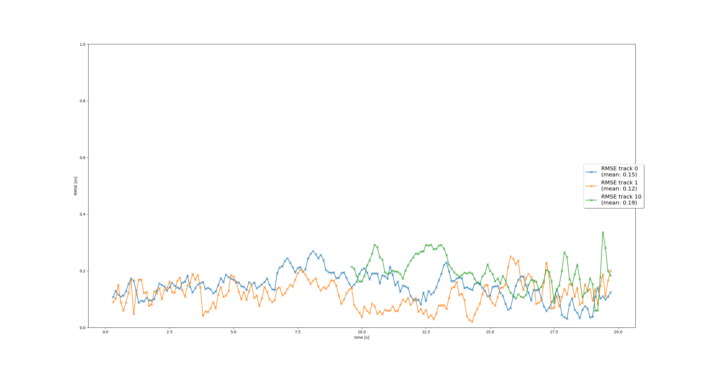

# Track 3D-Objects Over Time

### 1. Write a short recap of the four tracking steps and what you implemented there (filter, track management, association, camera fusion). Which results did you achieve? Which part of the project was most difficult for you to complete, and why?
In the final project, we had to develop the multi-target tracking of objects using recordings from the Waymo Open Dataset.
More specifically, we had to use the data of both the lidar and camera for the tracking task.
To succeed in the tracking, four tasks had to be solved:
1. Implement the equations of the Kalman Filter
2. Set up up the track management
3. Develop the association between the tracks and the sensor measurements
4. Integrate the camera sensor data into the tracking

#### 1. Kalman Filter Implementation
In this section, we had to implement both the prediction and update of the Kalman Filter algorithm.
For the prediction, the methods to compute the system matrix __F__ and the error covariance matrix __Q__ had to be implemented.
Both matrices have the dimension *6 x 6* as the state vector __x__ consisted of *6* states ($x$, $y$, $z$, $v_x$, $v_y$, $v_z$).

The update required the implementation of the residual $\gamma$ and its covariance matrix __S__, respectively.
Within the update method, the error covariance matrix __P__ and the state vector __x__ were updated using $\gamma$, __S__, the Kalman gain __K__ and the Jacobian __H__, respectively.

After completion, the execution of *loop_over_dataset.py* showed below RMSE plot:

#### 2. Track Management
For this section, it was required to solve the following:
1. Initialize a new track with the actual measurement.
2. Handle unassigned tracks by reducing their track score and deleting them from the track list in case the delete criteria are met.
3. Update assigned tracks by increasing their track score and setting their track state to *confirmed* in case the confidence threshold is reached.

To initialize the track with the measurement data, it is important to point out that the measurement data is taken in the sensor domain.
Therefore, it is required to transform the measurement into the vehicle coordinates.
The sensor class already provides the transformation matrix __T__ from sensor to vehicle space using homogeneous coordinates.
The positional entries of the error covariance matrix __P__ can also be initialized using __T__.
The velocity entries of __P__ will be initialized with hard-coded values of *params.py* as none of the sensors measure the speed.

To reduce the track score *s* of unassigned tracks, the equation $s = a \over w$ was used.
*w* is the window size to be monitored for the tracking. *a* is the number of assignments in the previous *w* cycles.
It is important to note that the track score should only be reduced if the unassigned track is located within the field of view of the
currently processed sensor.

The deletion of a track was performed if at least one of the following conditions was met:
1. The track score of a __confirmed__ track dropped below the deletion threshold
2. The error covariance of the x-posiion was above the maximum allowed error covariance
3. The error covariance of the y-posiion was above the maximum allowed error covariance
4. No measurement was assigned to the track for M consecutive cycles

In case a measurement was assigned to the track, the following steps were performed:
1. Add $1 \over w$ to the track score *s*
2. Set the track state to *confirmed* if *s* is above the *confirmed* threshold. Otherwise, assign *tentative*.

After the completion of the above-mentioned steps, the execution of *loop_over_dataset.py* showed below RMSE plot:

#### 3. Data Association
The data association required us to implement the logic to map one measurement to one specific track.
The association is represented by the association matrix __A__ of the dimension *t x m*.
*t* is the number of tracks, whereas *m* the number of measurements describes.
The association matrix contains the *Mahalanobis* distance between each track and measurements.

To complete this section, it was required to implement the following methods:
1. The computation of the Mahalanobis distance
2. The gating check for the computed Mahalanobis distance
3. The logic to find a pair of measurement and track

The gating and the mahalanobis distance were implemented according to the material from the lessons.

To find a pair of measurement and track, the following logic was used:
1. Find the element *a* with the __minimum__ Mahalanobis distance in __A__
    a. The row of the element represents the track
    b. The column of the element represents the corresponding measurement
2. Remove both the row and column containing *a* from __A__.
3. Repeat until no entries in __A__ are left. 

Instead of literally removing the row and column from __A__ as described above, I set the corresponding entries to infinity.
The reason is that the initial approach to remove entries led to issues with the data integrity.

After the completion of the above-mentioned steps, the execution of *loop_over_dataset.py* showed below RMSE plot:

### 2. Do you see any benefits in camera-lidar fusion compared to lidar-only tracking (in theory and in your concrete results)? 

### 3. Which challenges will a sensor fusion system face in real-life scenarios? Did you see any of these challenges in the project?

### 4. Can you think of ways to improve your tracking results in the future?

