# 3D Object Detection Project

In this project, we use the Waymo Open Dataset to explore 3D lidar sensor data. The sensor data is used to get hands-on experience on 3D object detection algorithms. Basically, 3D object detection is derived from the image-based approach. The trick is to transform the three-dimensional information to a two-dimensional
bird view (BEV). The lidar image can then be represented by three channels: the height, the intensity and the density. Similarly to the image color spaces, we can now apply the image object detection algorithm on the lidar data. The project guides us through the several steps of the data processing.

## Range Image
The first task was to extract the range image from the Waymo recording. From the range image, we were required to convert the channels "range" and "intensity" from floating-point data to an 8-bit integer value range. Additionally, we also had to handle outliers within the data. Otherwise, the outliers would lead to a distorted image making the analysis unfeasible. The image below depicts both the range (top) and intensity (bottom) image. The view is cropped to the yaw angle range of [-90, +90] degrees.

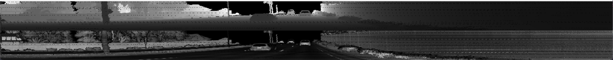

## Point Cloud
In this task, we had to display the lidar point cloud using the Open3D library. Below images depict cars with varying degrees of visibility. As mentioned in the classes, there is a blind spot around the system vehicle as the vehicle itself obstructs the lidar's field of view. Hence, vehicles close to the system will not be fully detected. We can also observe that detected cars will cast a 'shadow'. Objects within those 'shadows' won't be perceived by the lidar. In comparison to both the camera or radar, 
the lidar is able to detect the exact shapes and features of the road users, e.g. bumper and lights.

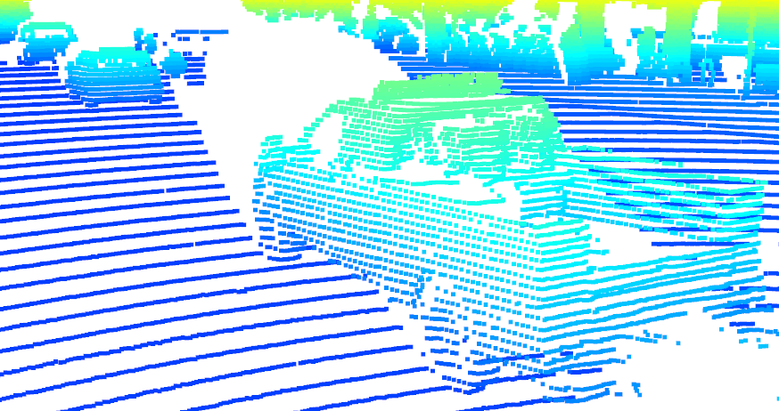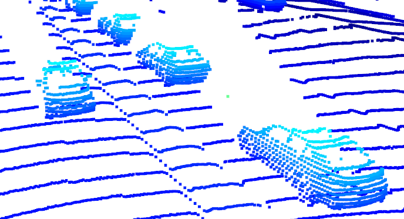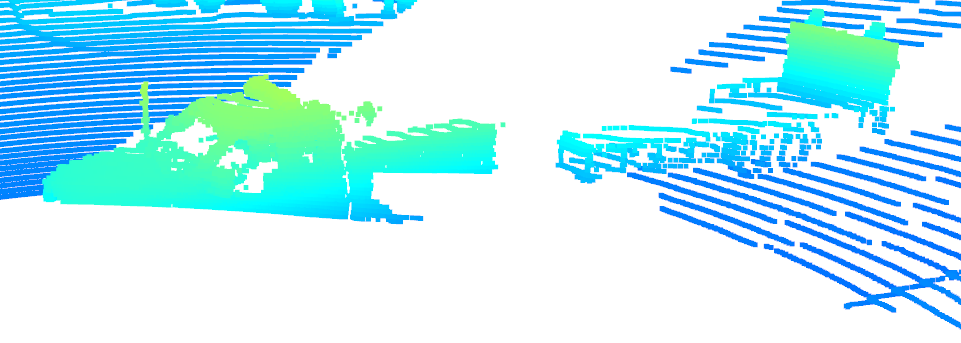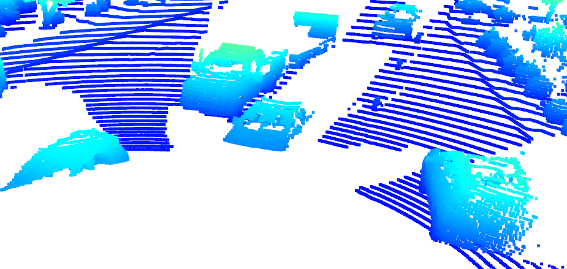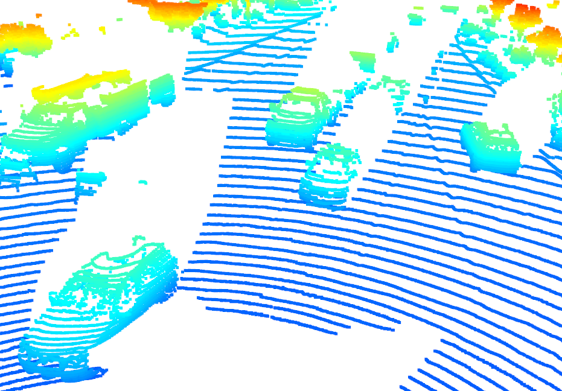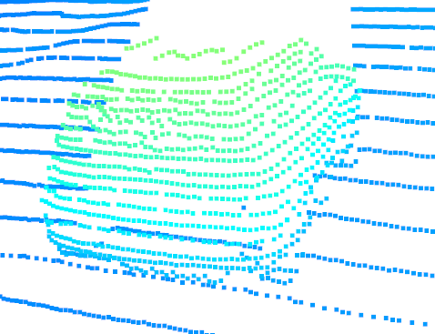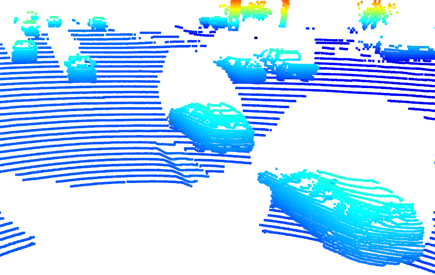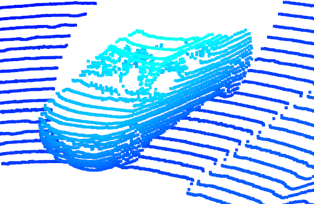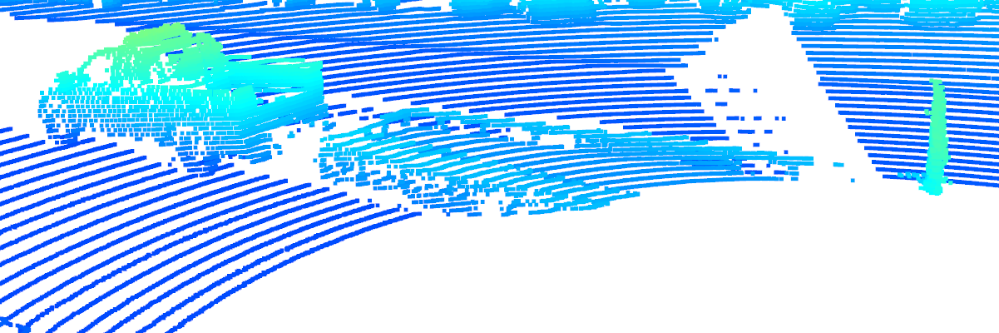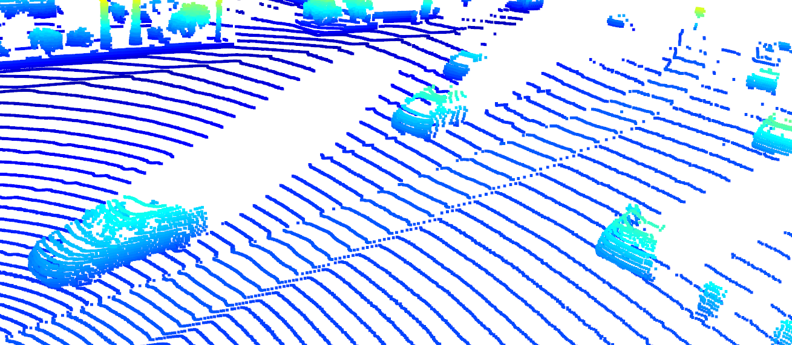

## Height and Intensity Map
Another task was to create a height and intensity map. Here, it was important to properly normalize the data to mitigate the distortion introduced by outliers. I implemented a method that scaled the outliers down based on a given percentile.
In the image, we can observe that all objects are displayed quite accurate.

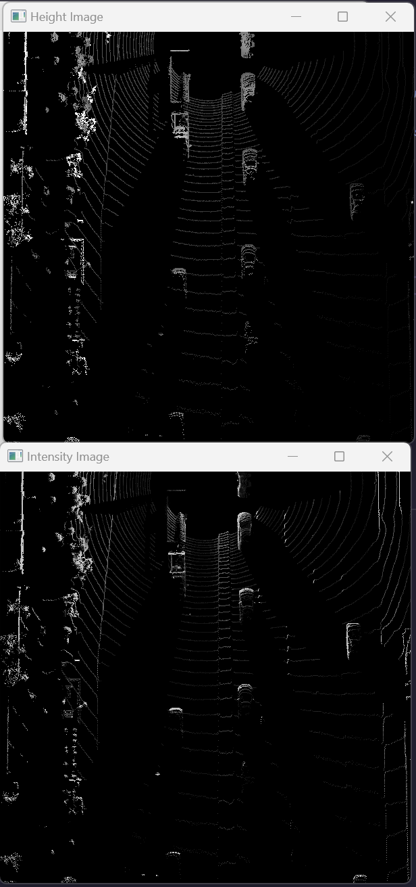
